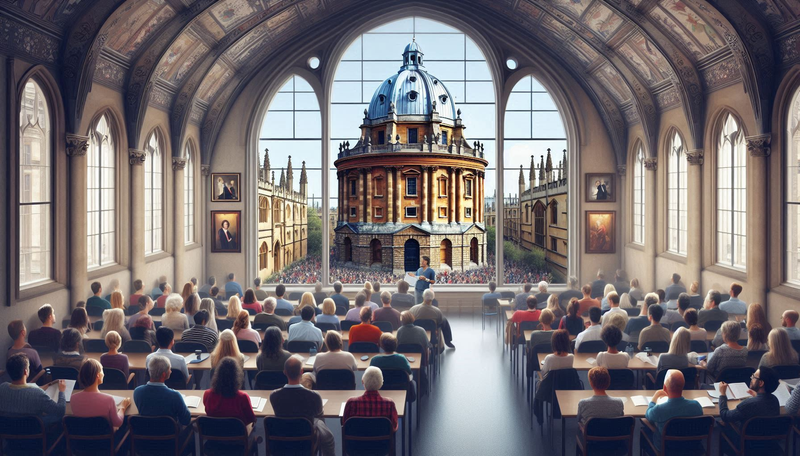

# 2nd workshop on Robust Agent-Based Modeling at Scale

## Dates

8th-9th July 2024

## Venue Location

[Rhodes House](https://www.rhodeshouse.ox.ac.uk/contact-staff/how-to-find-us), Conference Suite, South Parks Road, Oxford, OX1 3RG.

Rhodes House is a 15 minute walk from Oxford City Centre. On arrival, please use the main pillared
entrance.

Travelling by car - please be aware there is no visitor parking, and many Oxford streets are closed to
traffic. Visitors are encouraged to use the Park and Ride bus services. For information on services and
public car parks, please refer to the Oxfordshire County Council website.
- Travelling by train to Oxford station – Rhodes House is a 20-25 minute walk from the station
[Google map](https://www.google.co.uk/maps/dir/Oxford+Railway+Station,+Park+End+Street,+Oxford/Rhodes+House,+South+Parks+Road,+Oxford/@51.7554259,-1.2708864,15z/data=!3m1!4b1!4m14!4m13!1m5!1m1!1s0x4876c6a27be3b173:0x4fd8050ff7d88288!2m2!1d-1.2699127!2d51.7532879!1m5!1m1!1s0x4876c6a9ac61efe1:0x88030461ec1938d4!2m2!1d-1.2550284!2d51.7577037!3e2?hl=en). Alternatively, taxis are available outside the station.
- Travelling by coach from London or Heathrow / Gatwick airport - please get off at Gloucester Green.
- Local taxi companies:
- [Royal Cars](https://royal-cars.com/): 01865 777 333
- [001 Taxis](https://www.001taxis.com/): 01865 240 000
- [Go Green Taxis](https://www.gogreentaxisltd.co.uk/oxford-taxi-service/): 01865 922 222

## Accomodation

Please use the following search engines for accommodation availability:

- [SpeedyBooker.com](https://www.speedybooker.com/en-GB/search/in/Oxford) – Hotels, bed & breakfasts and self-catering
- [UniversityRooms.com](https://www.universityrooms.com/en-GB/city/oxford/home/?gad_source=1) – College accommodation
- [Booking.com](https://www.booking.com/city/gb/oxford.html?aid=1610684;label=oxford-D8gCTseE2Qkx_oD84j2YXwS380966947388:pl:ta:p1:p2:ac:ap:neg:fi:tikwd-65376592780:lp1006976:li:dec:dm:ppccp=UmFuZG9tSVYkc2RlIyh9YfqnDqqG8nt10AsofPfvtt0;ws=)

## Attendance and travel

Participation is free for this workshop, but attendees are required to cover their own costs relating
to travel and accommodation.

## Local contacts

- Jenny Dollard [jenny.dollard@cs.ox.ac.uk](mailto:jenny.dollard@cs.ox.ac.uk)
- Ani Calinescu [ani.calinescu@cs.ox.ac.uk](mailto:ani.calinescu@cs.ox.ac.uk)

While we update this site with more information, you can check the schedule of the workshop's first edition [here]({{ site.url }}/images/workshop_1.pdf).

- Dates: 8-9 July 2024
- Location: Rhodes House, Oxford
- Conference Dinner: Ashmolean Museum

## Schedule

You can find the workshop schedule [here]({{ site.url }}/images/workshop_2.pdf)

## Conference dinner

The conference dinner will take place at the [Ashmolean Museum](https://www.ashmolean.org/directions). Drinks reception starts at 7pm and dinner at 7.30pm on the Monday 8th.